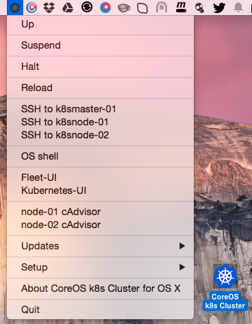

CoreOS-Vagrant Kubernetes Cluster GUI for OS X
============================

`CoreOS-Vagrant Kubernetes Cluster GUI for Mac OS X` is a Mac Status bar App which works like a wrapper around [coreos-vagrant](https://github.com/coreos/coreos-vagrant) command line tool and bootstraps Kubernetes cluster with one master and two minions machines.
 
[CoreOS](https://coreos.com) is a Linux distribution made specifically to run [Docker](https://www.docker.io/) containers.
[CoreOS-Vagrant](https://github.com/coreos/coreos-vagrant) is made to run on VirtualBox and VMWare VMs.



Download
--------
Head over to the [Releases Page](https://github.com/rimusz/coreos-osx-gui-kubernetes-cluster/releases) to grab the latest release.


How to install
----------

Required software:
* [VirtualBox for Mac OS X hosts](https://www.virtualbox.org/wiki/Downloads), [Vagrant for Mac OS X](http://www.vagrantup.com/downloads.html) and [iTerm 2](http://www.iterm2.com/#/section/downloads)
* Unzip downloaded file and copy e.g. the App to Desktop.
* Start the `CoreOS k8s Cluster` App and from menu `Setup` and choose: `Initial setup of CoreOS-Vagrant k8s Cluster` 

The install will do the following:

* All dependent files/folders will be put under `coreos-k8s-cluster` folder in the user's 
 home folder
* It will clone latest coreos-vagrant from git
* user-data files will have fleet, etcd and flannel set
* master machine will be set with IP `172.17.15.101` and two cluster nodes with IPs: `172.17.15.102 and 172.17.15.103`
* It will download latest vagrant VBox and run vagrant up to initialise VM
* It will download and install `fleetctl, etcdctl, kubectl and kubecfg` to `~/coreos-k8s-cluster/bin/`
* Kubernetes services will be installed with fleet units which are placed in `~/coreos-k8s-cluster/fleet`, that allows if necessary very easely to update fleet units.

How it works
------------

Just start `CoreOS k8s Cluster` application and you will find a small icon with the CoreOS logo with (K) which means for k8s cluster in the Status Bar.

* There you can `Up`, `Suspend`, `Halt`, `Reload` CoreOS vagrant VMs
* Under `Up` (first does 'vagrant up') and `OS Shell` OS Shell (terminal) will have such environment set:
````
1) kubernetes master - export KUBERNETES_MASTER=http://172.17.15.101:8080
2) etcd endpoint - export ETCDCTL_PEERS=http://172.17.15.101:4001
3) fleetctl endpoint - export FLEETCTL_ENDPOINT=http://172.17.15.101:4001
4) Path to ~/coreos-osx-cluster/bin where etcdclt, fleetctl and kubernetes binaries are stored
````

* `Updates/Force CoreOS update` will be run `sudo update_engine_client -update` on each CoreOS VM.
* `Updates/Check for updates` will update etcdclt, fleetctl and kubernetes OS X clients to the same versions as CoreOS VMs run. 
* `SSH to k8smaster01 and k8snode-01/02` menu options will open VM shells
* [Fleet-UI](http://fleetui.com) will show running fleet units and etc

Usage
------------

You're now ready to use Kubernetes cluster.

Some examples to start with [Kubernetes examples](https://github.com/GoogleCloudPlatform/kubernetes/blob/master/examples/).

Other links
-----------
* A standalone CoreOS VM version App can be found here [CoreOS-Vagrant GUI](https://github.com/rimusz/coreos-osx-gui).

* Cluster one without Kubernetes CoreOS VM App can be found here [CoreOS-Vagrant Cluster GUI](https://github.com/rimusz/coreos-osx-gui-cluster).

