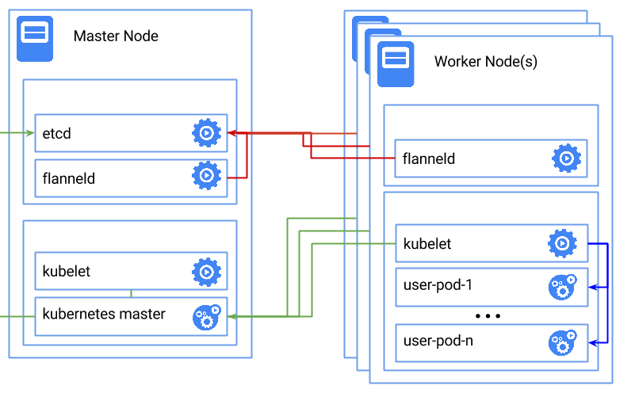

CoreOS-Vagrant Kubernetes Cluster for OS X
============================


`CoreOS-Vagrant Kubernetes Cluster GUI for Mac OS X` is a Mac Status bar App which works like a wrapper around [coreos-vagrant](https://github.com/coreos/coreos-vagrant) command line tool and bootstraps Kubernetes cluster with one master and two minions machines.

**NEW:** Includes [Helm](https://helm.sh) - The Kubernetes Package Manager


[CoreOS](https://coreos.com) is a Linux distribution made specifically to run [Docker](https://www.docker.io/) containers.
[CoreOS-Vagrant](https://github.com/coreos/coreos-vagrant) is made to run on VirtualBox and VMWare VMs.


Download
--------
Head over to the [Releases Page](https://github.com/rimusz/coreos-osx-gui-kubernetes-cluster/releases) to grab the latest release.


How to install
----------

Required software:
* [VirtualBox](https://www.virtualbox.org/wiki/Downloads), [Vagrant](http://www.vagrantup.com/downloads.html) and [iTerm 2](http://www.iterm2.com/#/section/downloads)
* Open downloaded dmg file and drag the App e.g. to your Desktop.
* Start the `CoreOS k8s Cluster` App and from menu `Setup` and choose: `Initial setup of CoreOS-Vagrant k8s Cluster`

The install will do the following:

* All dependent files/folders will be put under `coreos-k8s-cluster` folder in the user's
 home folder
* It will clone latest coreos-vagrant from git
* user-data files will have fleet, etcd and flannel set
* master machine will be set with IP `172.17.15.101` and two cluster nodes with IPs: `172.17.15.102 and 172.17.15.103`
* It will download latest vagrant VBox and run `vagrant up` to initialise VM
* When you first time install or do 'Up' after destroying k8s cluster, k8s binary files (with the version which was available when the App was built) get copied to CoreOS VMs, this speeds up k8s cluster setup. To update K8s cluster just run from menu 'Updates' - Update Kubernetes cluster and OS X kubectl.
* It will install `fleetctl, etcdctl and kubectl` to `~/coreos-k8s-cluster/bin/`
* Kubernetes services will be installed with fleet units which are placed in `~/coreos-k8s-cluster/fleet`, this allows very easy updates to fleet units if needed.
* Also [DNS Add On](https://github.com/GoogleCloudPlatform/kubernetes/tree/master/cluster/addons/dns) will be installed

How it works
------------

Just start `CoreOS k8s Cluster` application and you will find a small icon with the CoreOS logo with (K) which means for k8s cluster in the Status Bar.

* There you can `Up`, `Suspend`, `Halt`, `Reload` CoreOS vagrant VMs
* Under `Up` (first does 'vagrant up') and `OS Shell` OS Shell (terminal) will have such environment set:
````
1) kubernetes master - export KUBERNETES_MASTER=http://172.17.15.101:8080
2) etcd endpoint - export ETCDCTL_PEERS=http://172.17.15.101:4001
3) fleetctl endpoint - export FLEETCTL_ENDPOINT=http://172.17.15.101:4001
4) fleetctl driver - export FLEETCTL_DRIVER=etcd
5) Path to ~/coreos-osx-cluster/bin where etcdctl, fleetctl and kubernetes binaries are stored
````

* `Updates/Update Kubernetes cluster and OS X kubectl` will update to latest version of Kubernetes.
* `Updates/Update OS X fleetctl, etcdclt and fleet units` will update fleetctl, etcdclt clients to the same versions as CoreOS VMs run and to latest fleet units if the new version of App is used.
* `Updates/Force CoreOS update` will be run `sudo update_engine_client -update` on each CoreOS VM.
* `Updates/Check updates for CoreOS vbox` will update CoreOS VM vagrant box.
*
* `SSH to k8smaster01 and k8snode-01/02` menu options will open VM shells
* `node1/2 cAdvisor` will open cAdvisor URL in default browser
* [Fleet-UI](http://fleetui.com) dashboard will show running fleet units and etc
* [Kubernetes-UI](https://github.com/GoogleCloudPlatform/kubernetes/tree/master/www) (contributed by [Kismatic.io](http://kismatic.io/)) will show nice Kubernetes Dashboard, where you can check Nodes, Pods, Replication Controllers and etc.


Example ouput of succesfull CoreOS + Kubernetes cluster install:

````
$ 
etcd cluster:
/registry
/coreos.com

fleetctl list-machines:
MACHINE		IP		METADATA
9b88a46c...	172.17.15.103	role=node
d0c68677...	172.17.15.102	role=node
f93b555e...	172.17.15.101	role=control

fleetctl list-units:
UNIT				MACHINE				ACTIVE	SUB
fleet-ui.service		f93b555e.../172.17.15.101	active	running
kube-apiserver.service		f93b555e.../172.17.15.101	active	running
kube-controller-manager.service	f93b555e.../172.17.15.101	active	running
kube-kubelet.service		9b88a46c.../172.17.15.103	active	running
kube-kubelet.service		d0c68677.../172.17.15.102	active	running
kube-proxy.service		9b88a46c.../172.17.15.103	active	running
kube-proxy.service		d0c68677.../172.17.15.102	active	running
kube-scheduler.service		f93b555e.../172.17.15.101	active	running

k8s nodes list:
NAME                LABELS              STATUS
172.17.15.102       node=worker1        Ready
172.17.15.103       node=worker2        Ready

````


Usage
------------

You're now ready to use Kubernetes cluster.

Some examples to start with [Kubernetes examples](https://github.com/GoogleCloudPlatform/kubernetes/blob/master/examples/).

Other links
-----------
* A solo Kubernetes Cluster VM App can be found here [Kube-Solo for OS X](https://github.com/rimusz/kube-solo-osx).

* A standalone one CoreOS VM App (good for docker images building and testing) can be found here [CoreOS VM for OS X](https://github.com/rimusz/coreos-osx).

* Cluster one without Kubernetes CoreOS VM App can be found here [CoreOS-Vagrant Cluster for OS X](https://github.com/rimusz/coreos-osx-cluster).
